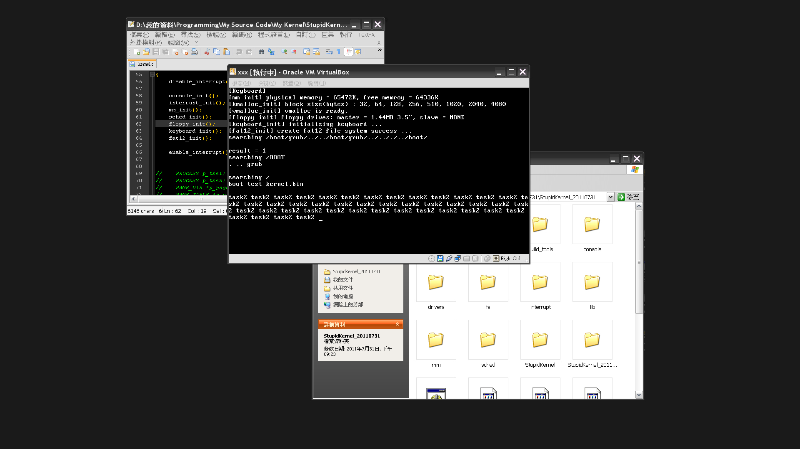

# StupidKernel
A very simple x86 OS kernel prototype I wrote long long time ago.  
    - Bootloader (Grub).  
    - VGA and console.  
    - Interrupt, and exception handlers.  
    - Physical, virtual memory segment and page management.  
    - Dynamic memory allocation.  
    - Floppy disc driver and FAT12 file system.  
    - Keyboard driver.  
    - Process scheduler.  
  
  
