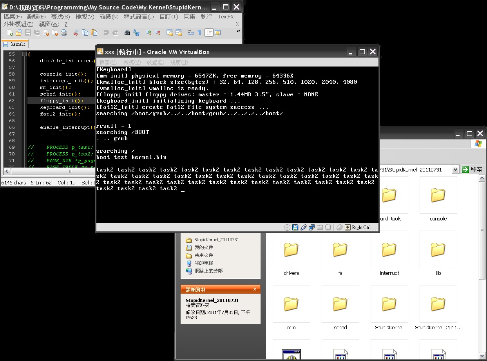

# StupidKernel
A very simple x86 OS kernel prototype I wrote long long time ago.  
    - Bootloader (Grub).  
    - VGA and console.  
    - Interrupt, and exception handlers.  
    - Physical, virtual memory segment and page management.  
    - Dynamic memory allocation.  
    - Floppy disc driver and FAT12 file system.  
    - Keyboard driver.  
    - Process scheduler.  
  
  
Build procedure:
---------------------
1. Make sure the build_tools folder is existed and the path is corrected.
2. Click the **build.bat** to launch build script.  
3. The script will generate a file named **kernel.bin** after build procedure is completed.
  

Installation:
---------------------
1. Open the **grub_floppy.img** by using floppy image editor tool like WinImage.
2. Put the new generated **kernel.bin** into root folder, and regenerate a new **grub_floppy.img**.
3. Burn the **grub_floppy.img** to a real 1.44" floppy disc, Insert the disc to your PC and set the boot source option to floppy disc.
4. Or install virtual machine program, create a virtual machine and boot from floppy disc.
  
  

